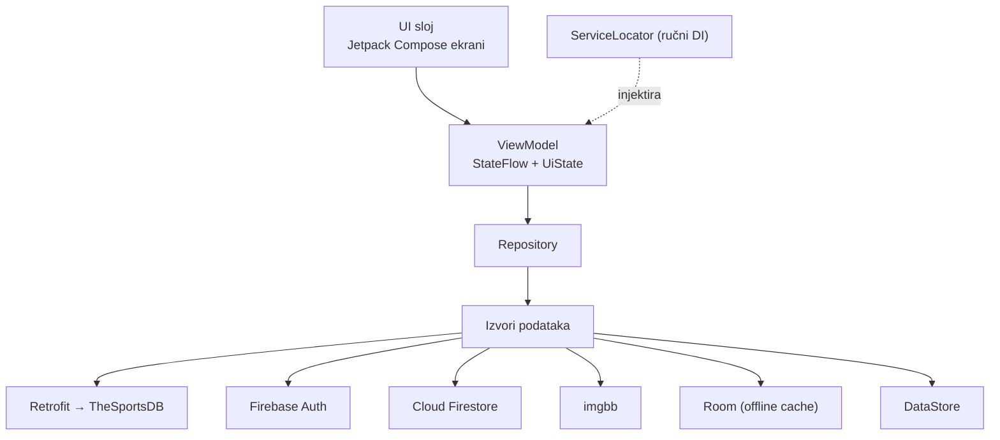

<div align="center">

# 🔵 Blue Pulse

**Navijačka Android aplikacija za GNK Dinamo Zagreb**

Utakmice · Igrači · Igrač mjeseca · HNL ljestvica · Galerija navijača · Karta stadiona


</div>

---

## 📖 Opis

**Blue Pulse** je nativna Android aplikacija namijenjena navijačima nogometnog kluba GNK Dinamo Zagreb. Na jednom mjestu okuplja raspored i rezultate utakmica, popis prve momčadi, glasanje za igrača mjeseca, ljestvicu Prve hrvatske nogometne lige (HNL), zajedničku galeriju navijačkih fotografija te interaktivnu kartu sa stadionom Maksimir.

Aplikacija je izrađena u **Kotlinu** i **Jetpack Composeu** (Material 3), prema **MVVM** arhitekturi s **offline‑first** pristupom — ključni zasloni rade i bez internetske veze zahvaljujući lokalnom Room cacheu.

> Izrađeno u sklopu kolegija **Razvoj mobilnih aplikacija**.

---

## ✨ Funkcionalnosti

| Područje | Značajke |
|---|---|
| **Autentifikacija** | Registracija (ime, e‑pošta, lozinka + potvrda), prijava/odjava, perzistencija sesije, prijateljske poruke o pogreškama (npr. zauzeta e‑pošta) |
| **Utakmice** | Nadolazeće i odigrane utakmice, detalji, **podsjetnik** (lokalna obavijest), dijeljenje, dodavanje u kalendar |
| **Igrači** | Popis prve momčadi (samo GNK Dinamo), pretraga i sortiranje (broj / prezime / glasovi), detalji igrača + osvojene titule |
| **Igrač mjeseca** | Glasanje (jedan glas po korisniku mjesečno, promjenjivo), trenutni rezultati, povijest pobjednika, broj titula |
| **Ljestvica** | HNL tablica s prikazom forme (W/D/L), istaknut Dinamo |
| **Galerija** | Objava fotografija s opisom, lajkovi (po korisniku), brisanje vlastitih, prikaz autora |
| **Profil** | Uređivanje imena i profilne slike, osobna statistika |
| **Karta i lokacija** | Stadion Maksimir, udaljenost korisnika (GPS) i navigacija |
| **Senzor** | Protresanje uređaja osvježava podatke (akcelerometar) |
| **Obavijesti** | Podsjetnik prije utakmice + periodična provjera rezultata (WorkManager) |
| **Offline** | Room cache utakmica i igrača; aplikacija nikad ne ostaje prazna |

---

## 🛠️ Tehnologije

| Sloj | Tehnologija |
|---|---|
| Jezik / UI | Kotlin · Jetpack Compose · Material 3 · Navigation Compose |
| Arhitektura | MVVM · Repository pattern · `UiState` · StateFlow · Kotlin Coroutines · ručni DI (ServiceLocator) |
| Mreža (REST) | Retrofit · Gson · OkHttp — **[TheSportsDB](https://www.thesportsdb.com/)** |
| Backend | Firebase Authentication · Cloud Firestore |
| Hosting slika | imgbb (radi na Firebase Spark planu) |
| Lokalna pohrana | Room (offline cache) · DataStore Preferences |
| Pozadinski rad | WorkManager |
| Karte / GPS | Maps Compose · Play Services Maps & Location |
| Slike | Coil |
| Dozvole | Accompanist Permissions |

---

## 🏗️ Arhitektura

Aplikacija slijedi **MVVM** s jasno odvojenim slojevima. Stanje svakog ekrana opisuje jedinstveni tip `UiState` (Loading / Success / Empty / Error) — svaka greška postaje stanje sučelja, a ne rušenje aplikacije.



**Offline‑first dohvat** (utakmice i igrači): `REST API → Room cache → lokalni seed`, pa zaslon nikad nije prazan. Domenske klase neovisne su o izvoru; DTO‑ovi i Room entiteti pretvaraju se u njih preko `toDomain()` / `toEntity()` extension funkcija i ne izlaze iz `data` sloja.

---

## 📂 Struktura projekta

```
com.dominik.bluepuls
├─ BluePulseApp.kt          Application (init DI + zakazivanje provjere rezultata)
├─ MainActivity.kt          Auth gate + navigacija
├─ core/                    UiState, Constants, DataOrigin, VotingPeriod, MatchDateTime, ShakeDetector
├─ di/                      ServiceLocator (ručni DI)
├─ domain/                  Match, Player, PlayerDetails, UserProfile, Photo, Standing, PlayerOfMonth, …
├─ data/                    Repozitoriji, DTO-ovi, mapperi, Retrofit, ImageUploader/Compressor
│  └─ local/                Room: AppDatabase, MatchDao/Entity, PlayerDao/Entity
├─ notifications/           NotificationHelper, MatchReminder/Result (Worker + Scheduler)
├─ presentation/
│  ├─ *ViewModel.kt         Auth, Home, Matches, Players, PlayerDetail, PlayerOfMonth, Standings, Gallery, Profile, Map
│  ├─ navigation/           Type-safe rute + bottom navigation
│  ├─ components/           AuthForm, StateViews, ShakeDetectorEffect, NotificationGate
│  └─ screens/              Svi Compose ekrani
└─ ui/theme/                Color, Type (Lexend/Roboto/Tektur), Theme
```

---

## 🚀 Pokretanje projekta

### Preduvjeti
- **Android Studio** (najnovija stabilna verzija)
- **JDK 17+** (dovoljan je JBR koji dolazi uz Android Studio)
- **Android SDK 36**, minimalni uređaj/emulator **Android 8.0 (API 26)**

### 1. Kloniraj repozitorij
```bash
git clone https://github.com/dmarenic/blue-pulse.git
cd blue-pulse
```

### 2. Postavi API ključeve (`local.properties`)
Iz sigurnosnih razloga API ključevi **nisu** u repozitoriju. U korijenu projekta stvori datoteku **`local.properties`** i dodaj:

```properties
# Putanju do SDK-a Android Studio postavlja sam (sdk.dir=...).

SPORTSDB_API_KEY=123        # besplatni dev ključ; za više podataka koristi vlastiti
MAPS_API_KEY=tvoj_maps_kljuc
IMGBB_API_KEY=tvoj_imgbb_kljuc
```

| Ključ | Čemu služi | Gdje dobiti |
|---|---|---|
| `SPORTSDB_API_KEY` | Utakmice, igrači, ljestvica | [thesportsdb.com](https://www.thesportsdb.com/api.php) (radi i besplatni `123`) |
| `MAPS_API_KEY` | Prikaz Google karte | Google Cloud Console → omogući *Maps SDK for Android* |
| `IMGBB_API_KEY` | Upload fotografija (galerija + profilna) | [api.imgbb.com](https://api.imgbb.com/) |

> ⚙️ **Projekt se builda i bez ovih ključeva** — imaju default vrijednosti, pa se kompajlira i pokreće. Bez `MAPS_API_KEY` karta se ne iscrtava, a bez `IMGBB_API_KEY` ne radi **upload** fotografija (postojeće se i dalje prikazuju). Sve ostalo radi i bez ključeva.

### 3. Firebase
`app/google-services.json` je uključen u repozitorij pa se projekt builda odmah. Za potpunu funkcionalnost u Firebase konzoli:
- **Authentication →** omogući *Email/Password*
- **Firestore Database →** objavi pravila iz [`firestore.rules`](firestore.rules)

### 4. Build i pokretanje
Otvori projekt u Android Studiju i pritisni **Run ▶**, ili iz terminala:
```bash
./gradlew assembleDebug
```

---

## 🧪 Testovi
```bash
./gradlew testDebugUnitTest
```
Jedinični testovi pokrivaju logiku modela i mapiranje DTO → domena (`MatchTest`, `MappersTest`).

---

## 🔒 Sigurnost
- **API ključevi** se čitaju iz `local.properties` preko `BuildConfig` — nikad u kodu ni u gitu.
- **Firestore pravila** ([`firestore.rules`](firestore.rules)): korisnik mijenja samo vlastiti profil, glasove i fotografije; **jedan glas po korisniku mjesečno** (ID dokumenta `{uid}_{period}`); lajk smije dodati/maknuti samo za sebe; povijest pobjednika je nepromjenjiva.
- Svaki mrežni i Firebase poziv obavijen je obradom iznimaka i pretvara se u `UiState.Error` — nijedan ne ruši aplikaciju.

---

## 👤 Autor
- **Student:** Dominik Marenić
- **Kolegij:** Razvoj mobilnih aplikacija
---

## 📄 Licenca
Projekt je izrađen u edukativne svrhe u sklopu fakultetskog kolegija. Svi nazivi i grbovi klubova vlasništvo su odgovarajućih nositelja prava.
